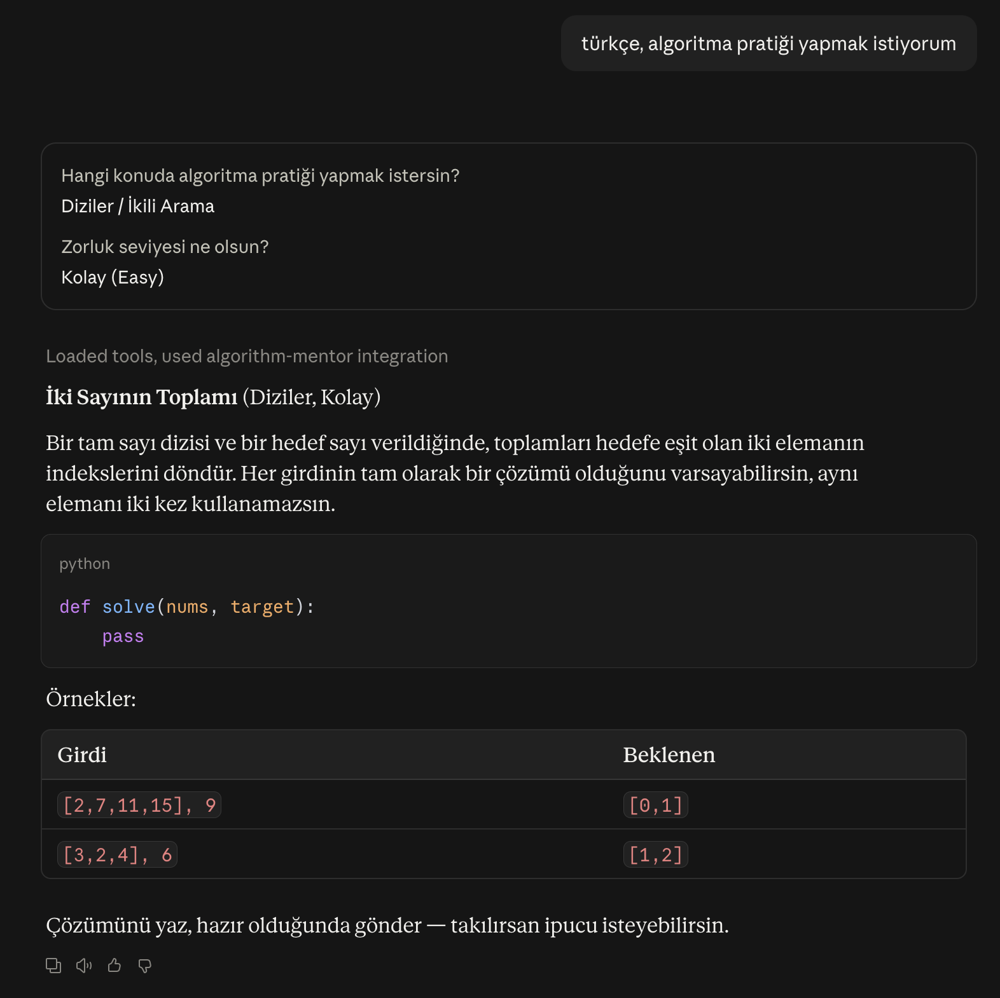
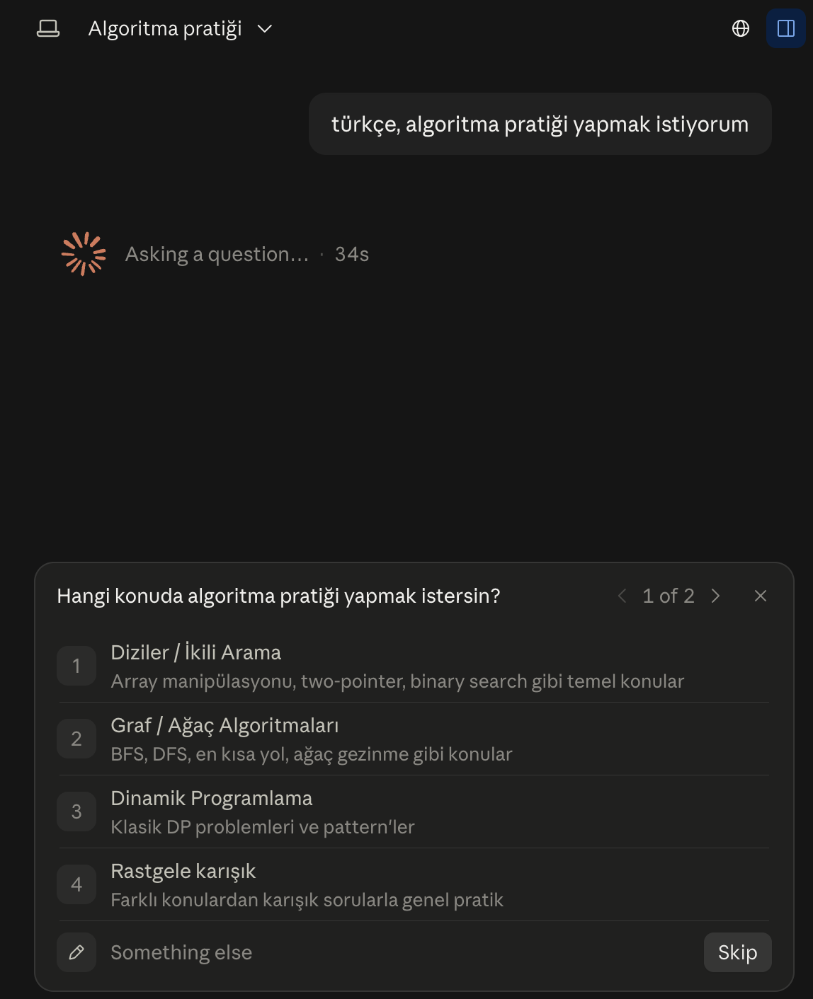
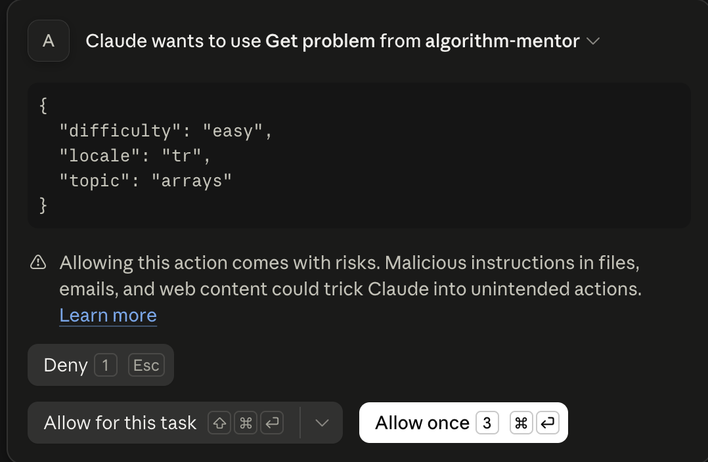
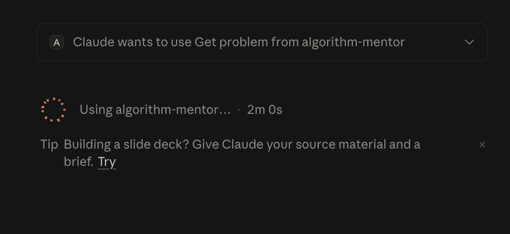
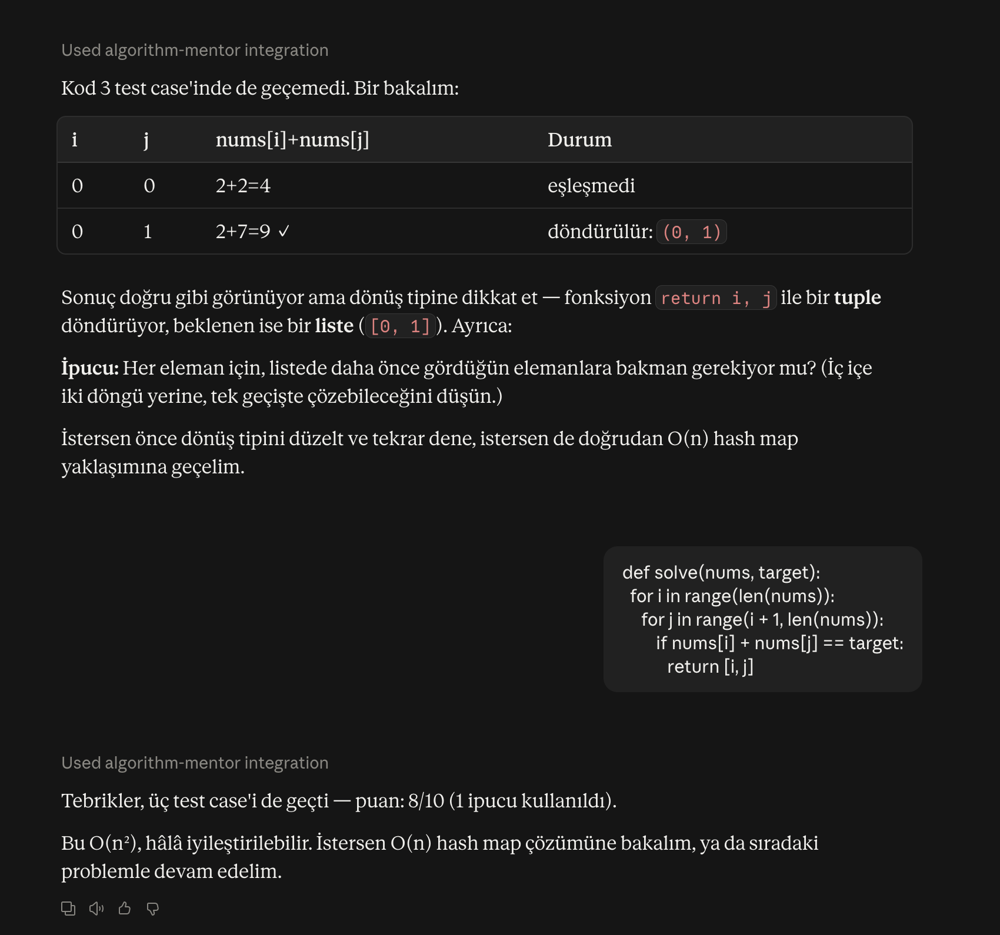
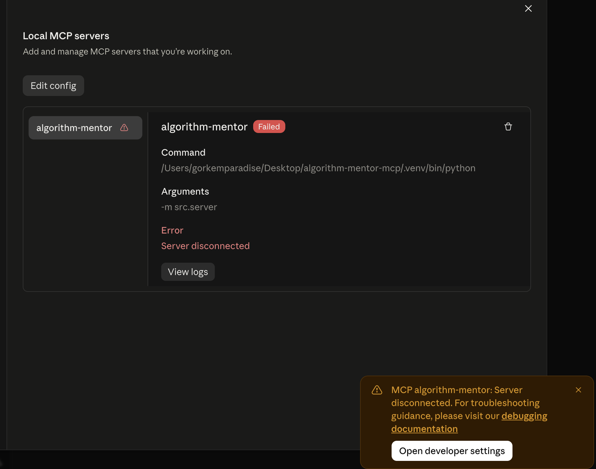

# Algorithm Mentor MCP

Seviyene adapte olan bir algoritma mentörü. Bir MCP (Model Context Protocol)
server olarak çalışır, Claude Desktop gibi bir host'a bağlanır ve seninle
Türkçe ya da İngilizce çalışır.

Klasik "soru sor, kodu çalıştır, sonucu söyle" akışından farkı şu: hangi
konularda güçlü, hangilerinde zayıf olduğunu takip eder, hata tiplerini
kaydeder ve bir sonraki konuyu buna göre önerir.

```
Assess → Konu seç → Problem ver → Dene → İncele → Profili güncelle → Sıradaki konu
```



## İçindekiler

- [Nasıl çalışır](#nasıl-çalışır)
- [Kurulum](#kurulum)
- [Claude Desktop'a bağlama](#claude-desktopa-bağlama)
- [İlk oturum](#i̇lk-oturum)
- [Tool'lar](#toollar)
- [Puanlama nasıl işliyor](#puanlama-nasıl-i̇şliyor)
- [Sorun giderme](#sorun-giderme)
- [Geliştirme](#geliştirme)

## Nasıl çalışır

Server dokuz tool yayınlar; host (Claude) bunları sırayla çağırır. Kritik
tasarım kararı şudur: **puanı server hesaplar, host değil.** Host yalnızca
"testler geçti mi", "kaç ipucu kullanıldı", "anlatım doğru muydu" gibi
sınırlı girdileri sağlar. Böylece model, profil verisini bir sayı
uydurarak bozamaz.

Profilin `profile.db` dosyasında tutulur: konu bazlı skorlar, son kanıtlar
ve tüm deneme geçmişi. Kodun ayrı bir süreçte, zaman ve kaynak limitleriyle
çalıştırılır.

## Kurulum

Python 3.11+ gerekir.

```bash
git clone https://github.com/gorkemergune/algorithm-mentor-mcp.git
cd algorithm-mentor-mcp
python3 -m venv .venv && source .venv/bin/activate
pip install -e ".[dev]"
```

Bu adım MCP SDK'sını (v2) ve testler için pytest'i kurar. Problem verisi
repo içinde gelir; ayrıca bir şey indirmen gerekmez.

## Claude Desktop'a bağlama

Ayarlar → Developer → Local MCP servers → **Edit config** ile açılan
dosyaya şunu ekle. Yolları kendi repo konumunla değiştir:

```json
{
  "mcpServers": {
    "algorithm-mentor": {
      "command": "/Users/kullanici/algorithm-mentor-mcp/.venv/bin/python",
      "args": ["-m", "src.server"],
      "env": { "PYTHONPATH": "/Users/kullanici/algorithm-mentor-mcp" },
      "cwd": "/Users/kullanici/algorithm-mentor-mcp"
    }
  }
}
```

Dört alanın da işlevi var:

| Alan | Neden gerekli |
| --- | --- |
| `command` | Venv'deki yorumlayıcı. Sade `python` yazarsan MCP SDK'sının kurulu olmadığı sistem Python'ına düşer. |
| `args` | Sunucuyu modül olarak çalıştırır. |
| `env.PYTHONPATH` | **En kritik alan.** Claude Desktop `cwd`'yi uygulamaz; bu olmadan `src` paketi bulunamaz ve sunucu açılmadan kapanır. |
| `cwd` | Uygulayan host'larda işe yarar, ama tek başına yeterli değildir. |

Claude Desktop'ı yeniden başlat. Bağlantı kurulduğunda tool listesinde
dokuz tool görünür: `assess_level`, `get_problem`, `submit_solution`,
`hint`, `explain_approach`, `get_reference_approach`, `review_solution`,
`update_profile`, `get_next_topic`.

Veri ve profil yolları çalışma dizininden bağımsızdır. Sunucu nerede
başlatılırsa başlatılsın aynı `profile.db` açılır, geçmişin kaybolmaz.

## İlk oturum

**1. Konuş, sana sorsun.** Hangi dilde yazarsan o dilde ilerler.

İlk oturumda **profilinin oluşturulmasını iste** — örneğin "önce seviyemi
değerlendir" ya da "profilimi oluştur" de. Bu, `assess_level` tool'unu
çağırır ve `profile.db` dosyasını kurar. Bu adım atlanırsa problem çözmeye
devam edebilirsin, ama hiçbir puan kaydedilmez: `update_profile` profil
olmadan çalışmaz ve ilerlemen oturum bitince kaybolur.



**2. Tool çağrısına izin ver.** İlk çağrıda Claude Desktop onay ister.
Argümanları görebilirsin, burada konu ve zorluk seçimi geçiyor.



Aynı akışı tekrar tekrar onaylamamak için "Allow for this task" seçeneğini
kullanabilirsin.



**3. Problemi al ve çöz.** Problem metni, başlangıç kodu ve görünür örnek
girdiler gelir. Gizli test case'ler sana gösterilmez, ama gönderdiğinde
onlar da çalıştırılır.


Yalnızca `solve` fonksiyonunu doldurman yeterli. Girdi okumana ya da sonucu
yazdırmana gerek yok, dönen değer karşılaştırılır.

**4. Takılırsan ipucu iste.** İpuçları kademelidir: önce yaklaşım yönü,
sonra veri yapısı, en son neredeyse-çözüm. Her ipucu puanını düşürür ama
denemeye devam etmeni sağlar.

**5. İncelemeyi oku.** Kod çalıştırılır, hangi test case'te kaldığın
söylenir, hata tipi sınıflandırılır ve profilin güncellenir.



Yukarıdaki oturumda kod önce üç test case'de kaldı, bir ipucundan sonra
geçti ve puan 0.8 oldu. İpucu kullanılmasaydı 1.0 olacaktı.

**6. Devam et.** "Sıradaki konu ne olsun" diye sorduğunda öneri, ön koşul
grafiğine göre gelir. Diziler konusunu geçmeden hashmap önerilmez, ağaçlar
olmadan graf önerilmez.

Profilin kurulu değilse bu adım `no profile yet — call assess_level first`
hatası verir; bu, verinin sessizce bozulmasını engelleyen bilinçli bir
davranıştır. Claude'dan seviyeni değerlendirmesini iste, sonra devam et.

Kod yazmak istemiyorsan yaklaşımını anlatman da bir deneme sayılır. Doğru
anlatım 0.5 puan alır; bu basamak bilerek var, çünkü çözümü bilip kodu
yazamamak farklı bir durumdur.

## Tool'lar

| Tool | Ne yapar |
| --- | --- |
| `assess_level` | Profili kurar, konuları sıfırdan seed'ler, başlangıç konusunu önerir |
| `get_problem` | Konuya ve zorluğa göre problem verir; gizli case ve ipuçları sızmaz |
| `submit_solution` | Kodu sandbox'ta çalıştırır, tüm test case'lerden geçirir |
| `hint` | Deneme sayısına göre kademeli ipucu verir |
| `explain_approach` | Sözlü anlatımı alır; hiçbir yere kalıcı yazmaz |
| `get_reference_approach` | Referans yaklaşımın etiketlerini ve özetini döner |
| `review_solution` | Puanı sabit tablodan üretir, hata tipini sınıflandırır |
| `update_profile` | Skoru doğrular, profili günceller, denemeyi kaydeder |
| `get_next_topic` | Ön koşul, en düşük skor ve sıkışma korumasıyla konu önerir |

Ayrıntılı parametre ve dönen değer tanımları için `docs/TOOLS.md`.

## Puanlama nasıl işliyor

Her deneme sabit bir tablodan puan alır:

| Durum | Puan |
| --- | --- |
| Geçti, ipucu yok | 1.0 |
| Geçti, 1 ipucu | 0.8 |
| Geçti, 2+ ipucu | 0.6 |
| Kod yok, yaklaşımı doğru anlattı | 0.5 |
| Geçmedi ya da yanlış anlattı | 0.2 |

Konu skoru üstel hareketli ortalamayla güncellenir, yani son denemeler daha
ağır basar. Ortalama skor seviyeni belirler: 0.4 altı başlangıç, 0.75 altı
orta, üstü ileri.

Aynı konuda üst üste üç başarısız deneme yaparsan sistem seni o duvara
tekrar tekrar çarptırmaz, bir alt ön koşula döner. Formülün tamamı ve
gerekçesi `docs/STUDENT_PROFILE_SCHEMA.md` içinde.

## Sorun giderme

**Sunucu "Failed" görünüyor, hata "Server disconnected"**



En sık sebep `PYTHONPATH` alanının eksik olması. Yapılandırmada dört alanın
da bulunduğundan ve yolların mutlak olduğundan emin ol. Aynı hatayı
terminalde de görebilirsin:

```bash
cd /tmp && /Users/kullanici/algorithm-mentor-mcp/.venv/bin/python -m src.server
# ModuleNotFoundError: No module named 'src'
```

`PYTHONPATH` verildiğinde bu komut sessizce beklemeye geçer, doğru davranış
budur; sunucu stdio üzerinden konuşur.

**Repoyu taşıdım, bağlantı koptu.** Yapılandırmadaki üç mutlak yolu da
güncelle. Venv taşınan klasörle birlikte gelir, yeniden kurmana gerek yoktur.

**Problem metinleri yanlış dilde geliyor.** Dil tercihi profile ilk
değerlendirmede yazılır. Claude'a hangi dilde çalışmak istediğini söyleyip
yeniden değerlendirme isteyebilirsin.

**Puanları sıfırlamak istiyorum.** Claude'dan yeniden değerlendirme
(`retake`) iste. Konu skorları sıfırlanır, deneme geçmişin korunur.
Tamamen sıfırdan başlamak için repo kökündeki `profile.db` dosyasını sil.

## Geliştirme

```bash
.venv/bin/python -m pytest
```

535 test var: skorlama, sandbox, depolama, tool'lar, veri şeması ve gerçek
bir MCP oturumu üzerinden uçtan uca akış. MCP SDK'sı gerektiği için venv
içinden çalıştır.

Proje kuralları basit: her tool önce `docs/TOOLS.md`'de spesifiye edilir,
sonra kodlanır; her tool en az bir testle gelir; kullanıcıya gösterilen her
metin TR ve EN olarak eklenir. Mimari kararlar ve devam noktası `CLAUDE.md`
içinde.

Yeni problem eklemek istersen `data/problems.json`'a ekle; şema testi eksik
alanı, eksik dili ya da eksik edge case'i otomatik yakalar.

Yol haritasında (v2): çoklu dil desteği, dil-idiom kontrolü, gelişmiş hata
sınıflandırması, dış platform entegrasyonu ve Docker tabanlı sandbox.

## Lisans

MIT — bkz. `LICENSE`.
